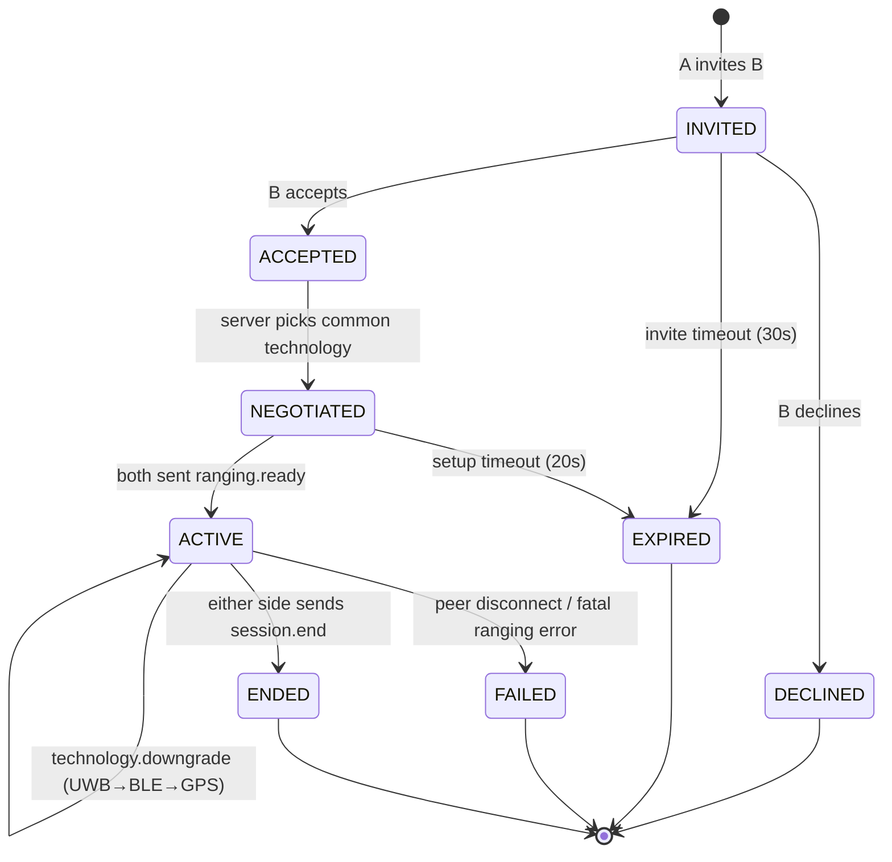
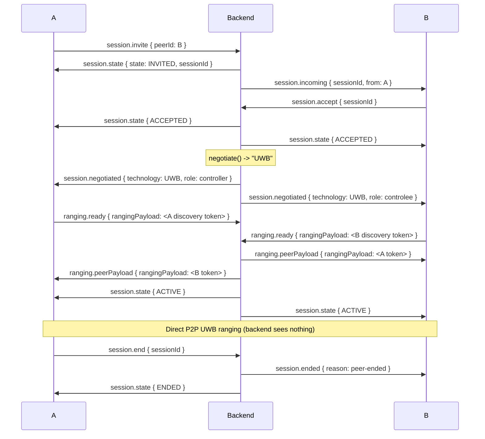
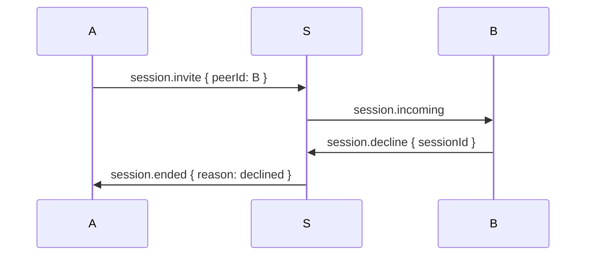

# uwb-peer-compass — Wire Protocol

**Version:** `1.0.0` (semantic; `protocolVersion` field on every message).
**Transport:** single WebSocket per authenticated device at `wss://HOST/ws?token=<accessJWT>`.
**Encoding:** JSON, UTF-8. Every message is an object with at least `{ v, type }` where
`v` is the protocol major version (integer `1`) and `type` is a namespaced string.

The backend is a **rendezvous broker**. It relays consent + opaque ranging payloads
between the two devices of a session. It never inspects, stores, or forwards distance,
direction, or position. The `rangingPayload` objects below are **opaque blobs**
produced/consumed only by clients (Apple discovery tokens, Jetpack UWB params, BLE ids).

Machine-readable schemas live next to this file in `shared/schemas/*.json` and are
validated by the backend test-suite (they are the source of truth).

---

## 1. Session state machine



Non-terminal timeouts (server-enforced, configurable):
- `INVITED`: 30 s → `EXPIRED`
- `ACCEPTED`/`NEGOTIATED`: 20 s → `EXPIRED`
- `ACTIVE`: 15 min hard cap → `ENDED` (sessions are meant to last minutes)

Downgrade never re-enters `NEGOTIATED`; it stays `ACTIVE` and emits a
`technology.downgrade` event so both clients re-render adaptive UI.

---

## 2. Technology negotiation

Given capability sets from both devices (sent at connect via `presence.hello`):

```
pick(a, b):
  if a.uwb and b.uwb and a.platform == b.platform:  return "UWB"
  if a.ble and b.ble:                               return "BLE"
  if a.gps and b.gps:                               return "GPS"
  return null  -> session FAILED (reason: no-common-technology)
```

`platform ∈ {ios, android}`. UWB is intra-platform only (ADR-0008).

---

## 3. Happy-path sequence (A initiates, both UWB, same platform)



---

## 4. Error / edge sequences

### 4.1 Decline


### 4.2 Invite timeout
`INVITED` with no accept/decline within 30 s → server emits
`session.ended { reason: expired }` to A; B's pending invite is cancelled.

### 4.3 Connection drop mid-session
If either device's WS closes while `ACTIVE`, the server transitions the session to
`FAILED` and sends `session.ended { reason: peer-disconnected }` to the survivor.
Clients stop ranging immediately and return to the peer list.

### 4.4 Mid-session downgrade (UWB lost)
A client that loses UWB emits `technology.report { technology: BLE, reason: uwb-lost }`.
The server validates BLE is a legal common technology, updates the session, and relays
`technology.downgrade { technology: BLE }` to **both** peers. Both switch provider and
render the adaptive (proximity) UI. Downgrade is one-way (never silent upgrade).

### 4.5 No common technology
Negotiation returns null → server sends `session.ended { reason: no-common-technology }`.

---

## 5. Message catalogue

### Client → Server
| type | payload | notes |
|------|---------|-------|
| `presence.hello` | `{ capabilities: {uwb,ble,gps}, platform }` | first msg after connect |
| `presence.heartbeat` | `{}` | every 15 s; missing 2 → offline |
| `session.invite` | `{ peerId }` | starts a session |
| `session.accept` | `{ sessionId }` | |
| `session.decline` | `{ sessionId }` | |
| `session.end` | `{ sessionId }` | explicit termination |
| `ranging.ready` | `{ sessionId, rangingPayload }` | opaque token blob |
| `technology.report` | `{ sessionId, technology, reason }` | runtime downgrade signal |

### Server → Client
| type | payload |
|------|---------|
| `presence.update` | `{ peerId, online }` |
| `session.state` | `{ sessionId, state }` |
| `session.incoming` | `{ sessionId, from: {id, username} }` |
| `session.negotiated` | `{ sessionId, technology, role }` |
| `ranging.peerPayload` | `{ sessionId, rangingPayload }` |
| `technology.downgrade` | `{ sessionId, technology }` |
| `session.ended` | `{ sessionId, reason }` |
| `error` | `{ code, message, sessionId? }` |

`role ∈ {controller, controlee}` (Jetpack UWB) / initiator-accessory (NI). `reason`
enum: `peer-ended, declined, expired, peer-disconnected, no-common-technology,
ranging-failed`.

---

## 6. Versioning

- `v` (integer) = **major**. Breaking changes bump it; server rejects unknown majors
  with `error { code: UNSUPPORTED_PROTOCOL }`.
- Additive fields are backward compatible within a major and need no bump.
- `protocolVersion` string constant (`1.0.0`) is exported from
  `shared/schemas/version.json` and embedded in `presence.hello`.
